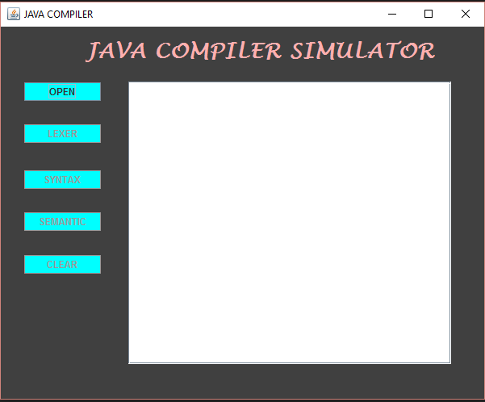
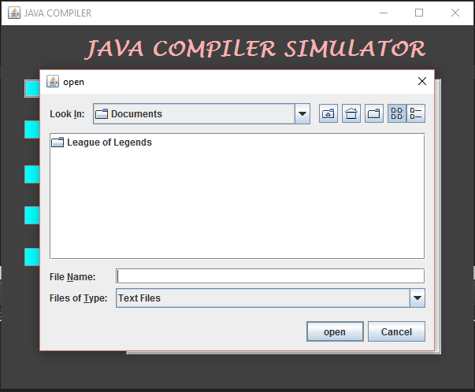
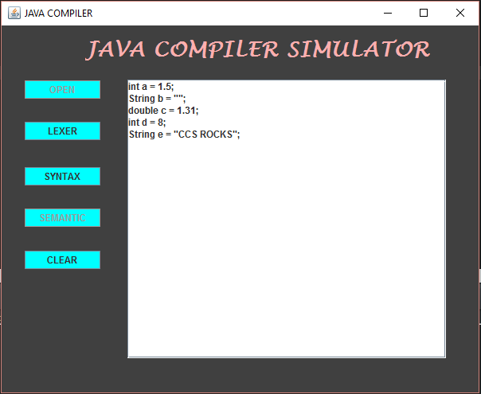
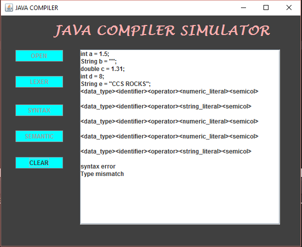

# Java Compiler Simulator

The study covers 3 Analysis: 
Lexical Analysis, Syntactic Analysis, and Semantic Analysis.

## Lexical Analysis 

the process of converting a sequence of characters (such as in a computer program or web page) into a sequence of tokens (strings with an identified "meaning"). A program that performs lexical analysis may be called a lexer, tokenizer, or scanner (though "scanner" is also used to refer to the first stage of a lexer). Such a lexer is generally combined with a  parser, which together analyze the  syntax of  programming  languages, web pages, and so Forth.

## Semantic Analysis

the context sensitive analysis, is a process in  compiler construction, usually after  parsing, to gather necessary semantic information from the  source code. It usually includes type, or makes sure a variable is declared before use which is impossible to detect in parsing. 

## Parsing or Syntactic Analysis

the process of analyzing a  string of  symbols, either in  natural language or in  computer languages, conforming to the rules of formal. The term parsing comes from Latin pars (orationis), meaning  part (of speech). The term has slightly different meanings in different branches of  linguistics and  computer science. Traditional sentence parsing is often performed as a method of understanding the exact meaning of a sentence, sometimes with the aid of devices such as  sentence diagrams. It usually emphasizes the importance of grammatical divisions such as  subject and predicate. 

# SCREENSHOTS

